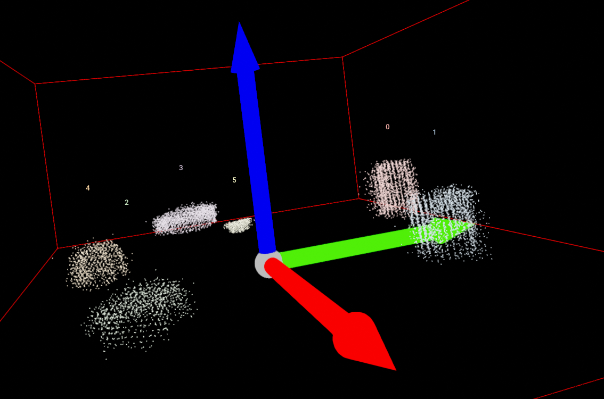

<!-- PROJECT LOGO -->
 

  

  <h3 align="center">Best-README-Template</h3>

  

    An awesome README template to jumpstart your projects!
     
    <a href="https://github.com/RSiopa/SAVITP2/tree/main/docs"><strong>Explore the docs »</strong></a>
     
     
    <a href="https://github.com/RSiopa/SAVITP2/issues">Report Bug</a>
    ·
    <a href="https://github.com/RSiopa/SAVITP2/issues">Request Feature</a>
  

# B.O.T. Finder
What's B.O.T. porpouse? To find stuff on tables and tell us what they are.

O B.O.T. Finder was created to respond to the challenge "Where's my coffee mug?" proposed in the subject Advanced Industrial Vision Systems at the University of Aveiro.
It consists of a system that, from a given cloud of points, can detect and extract objects, calculate some of their characteristics and in turn classify the detected object, based on a previously trained deep learning classifier. Finally being able to return the name of the objects and some of their characteristics.

The data used for training the classifier and the point clouds can be accessed at [Washington RGB-D Dataset](http://rgbd-dataset.cs.washington.edu/dataset/).
The dataset for the classifier ([RGB-D Object Dataset](http://rgbd-dataset.cs.washington.edu/dataset/)) contains 300 objects grouped into 51 categories.
The dataset [RGB-D Scenes Dataset](http://rgbd-dataset.cs.washington.edu/dataset/rgbd-scenes-v2/) contains the 14 scenes with furniture (sofas and tables) and a subset of the objects present from the RGB-D Object Dataset (bowls, caps, cereal boxes, coffee mugs, and soda cans).

# Get Started

# Autores
- [Rafael Siopa](https://github.com/RSiopa)
- [Gil Viegas](https://github.com/gilviegas)
- [Emanuel Fonseca](https://github.com/emanuelfonseca99)

# About
We are Industrial Automation Engineering students at Universidade de Aveiro.

