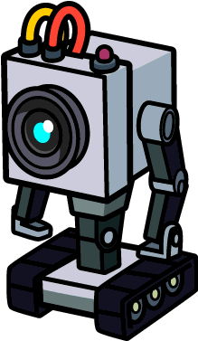
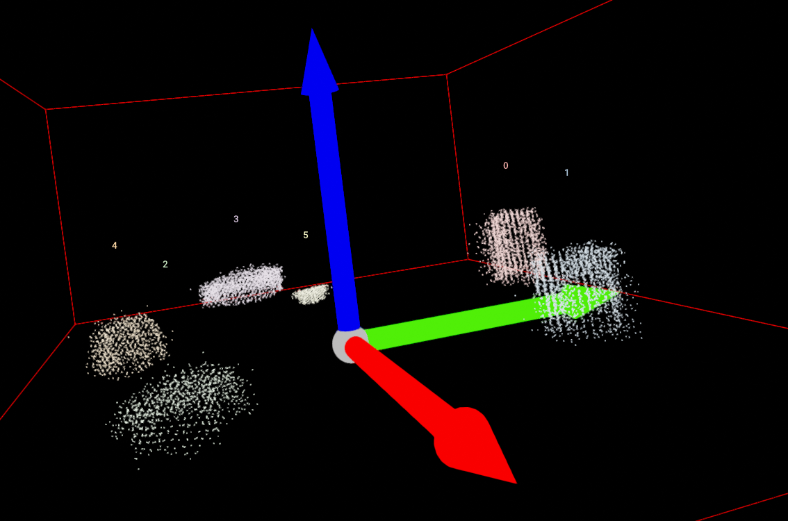

# B.O.T. Finder
What's B.O.T. porpouse? To find stuff on tables and tell us what they are.



O B.O.T. Finder was created to respond to the challenge "Where's my coffee mug?" proposed in the subject Advanced Industrial Vision Systems at the University of Aveiro.
It consists of a system that, from a given cloud of points, can detect and extract objects, calculate some of their characteristics and in turn classify the detected object, based on a previously trained deep learning classifier. Finally being able to return the name of the objects and some of their characteristics.

The data used for training the classifier and the point clouds can be accessed at [Washington RGB-D Dataset](http://rgbd-dataset.cs.washington.edu/dataset/).
The dataset for the classifier ([RGB-D Object Dataset](http://rgbd-dataset.cs.washington.edu/dataset/)) contains 300 objects grouped into 51 categories.
The dataset [RGB-D Scenes Dataset](http://rgbd-dataset.cs.washington.edu/dataset/rgbd-scenes-v2/) contains the 14 scenes with furniture (sofas and tables) and a subset of the objects present from the RGB-D Object Dataset (bowls, caps, cereal boxes, coffee mugs, and soda cans).

# Get Started
First, B.O.T. must train his eyes and brain.
In /SAVI TP2/Model Training you can find the script model_training.py to train B.O.T.
We already provide a trainned model in the folder /SAVI TP2/Model Training/Best_Model if you wish to use.

```
usage: model_training.py [-h] [-rt] [-lr LEARNING_RATE] [-mne MAXIMUM_NUM_EPOCHS] [-tlt TERMINATION_LOSS_THRESHOLD] [-mp MODEL_PATH] [-dp DATASET_PATH] [-in IMAGE_NUMBER] [-ts TEST_SIZE]
                         [-tbs TRAINING_BATCH_SIZE] [-tesbs TESTING_BATCH_SIZE]

Training of the Deep Learning Model

options:
  -h, --help            show this help message and exit

  -rt, --resume_training
                        Continue previous training. default=True

  -lr LEARNING_RATE, --learning_rate LEARNING_RATE
                        Define the learning rate. default=0.001

  -mne MAXIMUM_NUM_EPOCHS, --maximum_num_epochs MAXIMUM_NUM_EPOCHS
                        Define the maximum number of epochs. type=int, default=1000

  -tlt TERMINATION_LOSS_THRESHOLD, --termination_loss_threshold TERMINATION_LOSS_THRESHOLD
                        Define the termination loss threshold. default=0.001

  -mp MODEL_PATH, --model_path MODEL_PATH
                        Define the path for the model file. default=model.pkl

  -dp DATASET_PATH, --dataset_path DATASET_PATH
                        Define the path for the dataset. default=Datasets/rgbd-dataset

  -in IMAGE_NUMBER, --image_number IMAGE_NUMBER
                        Define the number of images to use for sampling. metavar=IMAGE_NUMBER, type=int, choices=range(1, 200000), default=1000

  -ts TEST_SIZE, --test_size TEST_SIZE
                        Define the percentage of images used for testing. default=0.2

  -tbs TRAINING_BATCH_SIZE, --train_batch_size TRAINING_BATCH_SIZE
                        Define batch size for training. metavar=TRAINING_BATCH_SIZE, type=int, choices=range(25, 10000), default=500

  -tesbs TESTING_BATCH_SIZE, --test_batch_size TESTING_BATCH_SIZE
                        Define batch size for testing. metavar=TESTING_BATCH_SIZE, type=int, choices=range(25, 10000), default=500
```




# Autores
- [Rafael Siopa](https://github.com/RSiopa)
- [Gil Viegas](https://github.com/gilviegas)
- [Emanuel Fonseca](https://github.com/emanuelfonseca99)

# About
We are Industrial Automation Engineering students at Universidade de Aveiro.

